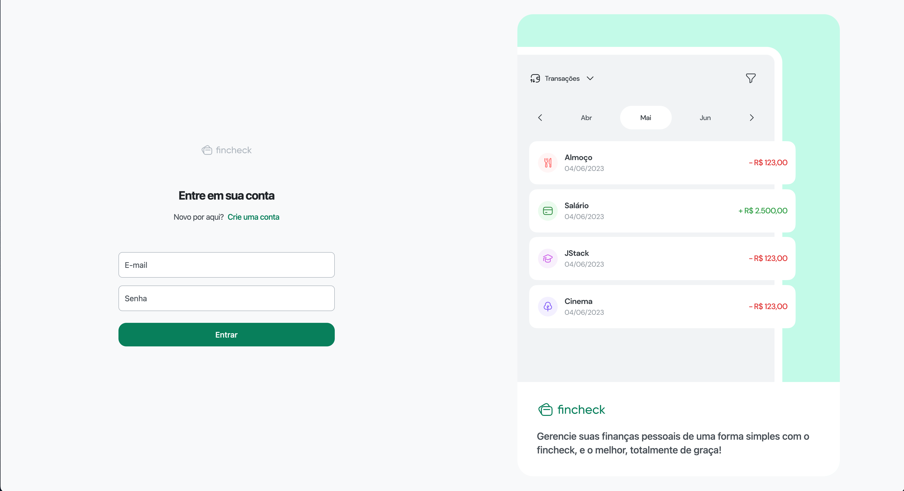

## 💻 Projeto

Finchek - É um app de controle de finanças pessoais, desenvolvido no curso [JStack](https://jstack.com.br/).

## 🚀 Tecnologias utilizadas

- [Zod](https://zod.dev/)
- [Vite JS](https://vitejs.dev)
- [Axios](https://axios-http.com/ptbr/)
- [Tailwindcss](https://tailwindcss.com/)
- [Typescript](https://www.typescriptlang.org)
- [React Hot Toast](https://react-hot-toast.com/)
- [React Hook Form](https://react-hook-form.com/)
- [React Query](https://tanstack.com/query/latest/)
- [React Router Dom](https://reactrouter.com/en/main)

## 📄 License

Este projeto está sob a licença MIT
